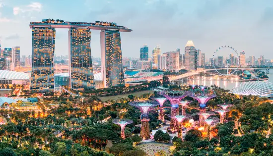

### What you need to know

Hanoi - The capital of Vietnam. Despite its population of more than 10 million people, Hanoi retains a big village-like vibe. Vendors on bicycles crowd the streets, motorbike traffic is chaotic, and public transportation is almost non-existent. The city perfectly blends colonial French architecture with Southeast Asia's modern hustle and bustle. The majority of travelers stay in Hanoi's Old Quarter, which is located around Hoan Kiem Lake. This is where you'll find the majority of the low-cost and boutique lodging alternatives.

### Start packing for your vacay
1. ksdfcbxc
2. dshkacbfs
3. sdfkhds