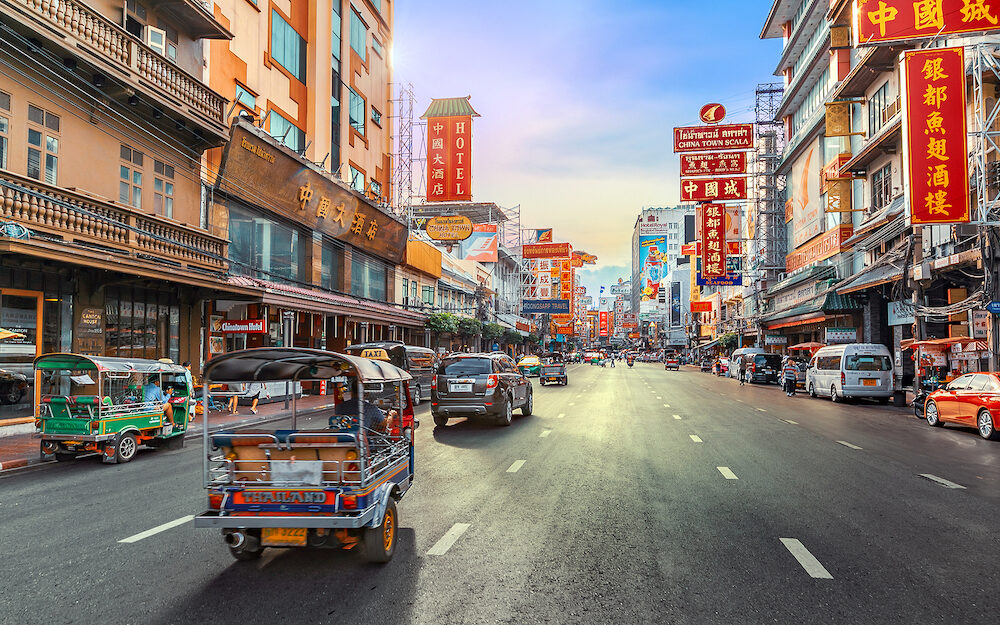

## Detail
Bangkok is one of those cities that never gets old. No matter how many times you’ve been, you’ll always discover something new and exciting to see, do, and eat.

It’s got a near perfect mix of food, culture, nightlife, shopping, and affordability that’s unmatched anywhere in Southeast Asia. It is a well-rounded and intriguing location to visit, with historical landmarks and a thriving culture. This city also boasts some of the most interesting, spicy, and delicious street cuisine I've ever encountered. Here's my comprehensive Bangkok travel guide to assist you in planning your trip to Thailand!

## Outcomes
1. Street food
2. Siam Paragon